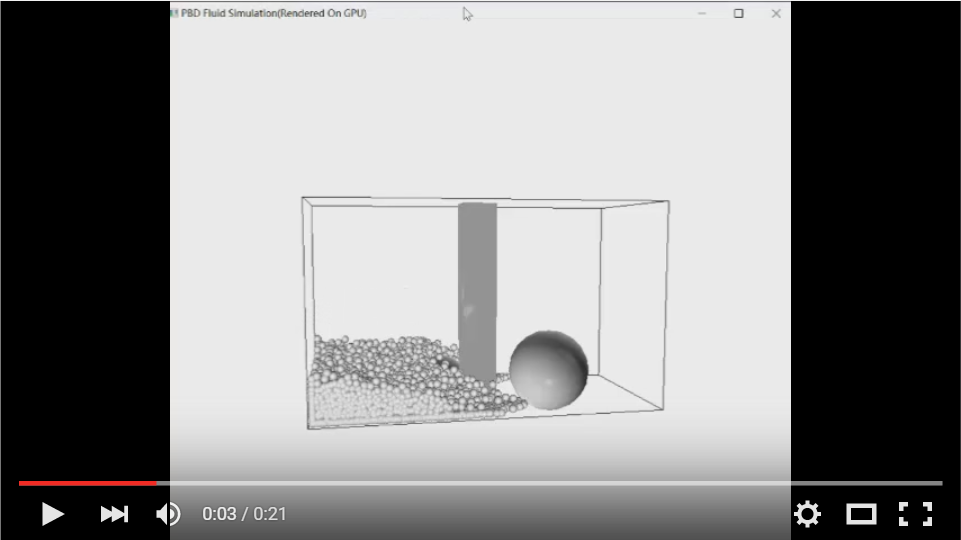

# PBDFluid
## This is the project for Penn CIS563(Physical-based Animation)
## Team Member: Siqi Huang, Hansi Liu, and Weijian Zhou

# Real-time Demo(20*25*20 Particles Collision with objects)
## CPU(Inter(R) Core(TM) i7-4870HQ 2.5GHZ)

## GPU(NVIDIA GeForce GTX 970M)

Those two videos basically rendered the same scene, but obviously after using GPU to accelerate, the render is more than 10 times faster(of course the actual speed depend on your own hardware).

# PART 0 Architecture and Control(Siqi Huang)
## Architecture
In this project, we have used some other's code as referrence, which it is necessary to acknowledge here: 
1 The basic openGl view is gluv and glew. For gluv part, we have using some of Zonghan Xu's code as referrence. 
2 The basic structure of the code is referred to Tiantian Liu's Deformable_body_Sim 
3 The gl buffer part, vertex and fragment shader is mostly from Tiantian Liu's project 

## Control
### Real-time input
Use mouse to rotate the scene, the gravity change's with the view.
Use blankspace to move to the next frame

### Input
Use CPU_RENDER or GPU_RENDER to specify render mode 
Use CONTAINER_CUBE or CONTAINER_SPHERE to specify container shape(container always at origin) and x y z(or r) to specify dimension(or radius) 
Use EYE,LOOKAT,UP to setup camera 
Use PARTICLE x y z to specify particle number 
Use MINPOS to specify start position of particles 
Use DIS to specify particle distance 
Use CUBE or SPHERE to add object in scene, also add POSITION, DIMENSION(RADIUS). Rules are the same as CONTAINER except that position is specified 

### Constraint
All adjustable parameter are in the constraint.h

# PART I: Basic Simulation Flow(Siqi Huang)
Make sure basic simulation is going on. For instance, velocity and position is updated.
## Key function:
void updateAcc() 
void updateVel() 
void updatePos() 
...

# PART II: Fluid PBD Core Function(Hansi Liu)
This is the most important part. We need to make sure the physical part of the simulation is right. 
## Key function:
void PBDProjection()(lamda correction for viscosity is calculated here) 
void calculateLamda(Particle &p) 
float poly6Kernel(float h,glm::vec3 r) 
glm::vec3 spikyKernel(float h,glm::vec3 r) 
void findNeighbor();
...

# PART III: Grid Structure Design and Implementation(Weijian Zhou)
To find neighbor efficiently, we use grid to store position of each particle and find by nearby grid. We sacrifice space for speed here.
## Key function
all function in grid and cell class

# PART IV: Container Collision with particle(Hansi Liu)
We designed sphere and cube container. Because we use PBD, the collision with container is complex as not to go against PBD rules.
## Key function:
void staticIntersection(Particle &p)()
init function for container

# PART V: Object Collision with particle(Weijian Zhou)
Our particle can also collide with object like cube and sphere. Although we have done the collision with mesh object, the effect is not very correct. So we do not include that in the final simulation.
## Key function:
void staticIntersection(Particel &p)
init function for primitive

# PART VI: GPU Implementation(Siqi Huang)
To increse our speed, we decide to implement our project using GPU. As is shown in the demo video, GPU is much more faster than CPU. Although GPU is fast, due to the imprecise of calculation on GPU, some particle MAY have some strange motion. However, the number is limited when we use 10000 particles to render.
## Key function:
all function in kernel.h and kernel.cu

# PART VII: Reference(Hansi Liu)
[1] Macklin M, Müller M. Position based fluids[J]. ACM Transactions on Graphics (TOG), 2013, 32(4): 104.
